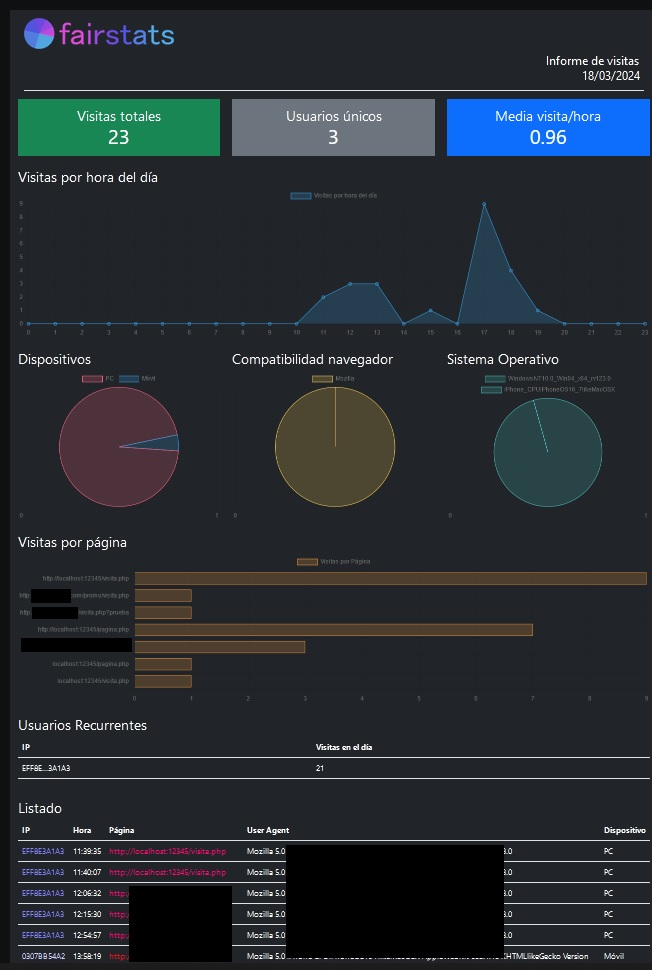

 
# fairstats v.0.1 a
Herramienta PHP de analítica web que no utiliza base de datos, cookies ni datos personales de los usuarios. Se trata de una versión alfa muy básica, por lo que espero poder seguir mejorándola en el futuro. No se han implementado medidas de seguridad para el acceso al dashboard, pendiente para la próxima versión. 

 

# Funciones de análisis de visitantes

- Número de visitas diarias
- Visualización de visitas por hora
- Usuarios únicos
- Usuarios recurrentes ese día
- Visitas por página (páginas visitadas y número de visitas)
- Tipo de dispositivo
- Compatibilidad del navegador
- Sistema operativo
- Listado completo de visitas

# Enfocado en la privacidad del usuario

Fairstats se basa en (1) el principio de minimización de datos, obteniendo únicamente datos no personales, y (2) la pseudoanonimización de las direcciones IP, dato que sí se ha considerado personal pero que en este ejercicio de programación se enmascara, como veremos a continuación. El proceso de pseudoanonimización implica transformar mediante varios pasos la dirección IP del usuario en una representación hash. Esta representación hash conserva la información esencial para fines de análisis mientras hace prácticamente imposible revertir la dirección IP original. 

Para ello, la IP se somete a un primer proceso de hashing usando el algoritmo SHA-256. Se utiliza el tamaño del archivo agente "visita.php" para generar, a su vez, dos hashes: uno MD5 y otro SHA-256. Estos últimos dos hashes son agregados al primer hash que contiene la IP encriptada, y con su resultado se realiza un hashing iterativo en SHA-256 (cinco veces). Esto mantiene la privacidad del usuario mientras preserva la usabilidad de los datos objeto de análisis. Este proceso de pseudoanonimización combina técnicas criptográficas robustas con medidas de seguridad adicionales para proteger efectivamente los datos del usuario. Los usuarios pueden confiar en que su privacidad es respetada sin comprometer la utilidad de nuestra herramienta de análisis.

# Licencia

Este software ha sido desarrollado por JCRueda.com. El proyecto se regula de acuerdo con los términos de la licencia Creative Commons Atribución (CC BY). Esta licencia permite a los usuarios utilizar el software libremente y realizar modificaciones, siempre que se reconozca la autoría del trabajo original. Debe citarse el repositorio original del archivo: https://github.com/disketteomelette/fairstats

# Configurando fairstats

Fairstats es muy sencillo de configurar si tu aplicación funciona en PHP (Wordpress, Joomla, etc.). Basta con colocar el agente y el dashboard en tu carpeta principal, y llamar al agente mediante un include en un header o footer (visita.php). 
En caso de páginas HTML u otras tecnologías, si tu servidor es Apache puedes añadir la siguiente regla a tu archivo .htaccess para permitir ejecutar scripts PHP en archivos distintos a .php :   AddType application/x-httpd-php .html

# Descargo de responsabilidad

Fairstats no debería usarse al tratarse de una versión muy básica. El quíntuple hashing que efectúa puede sobrecargar tus servidores, especialmente si tienes muchas visitas (por lo que es ineficiente). No me hago responsable del uso de esta aplicación.
